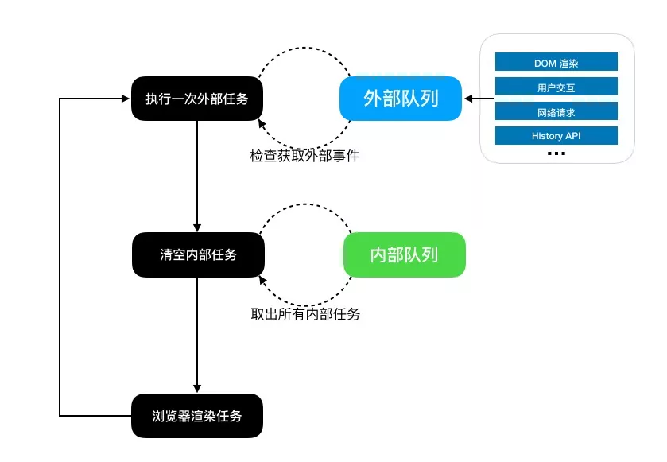

# 理解事件循环(Event Loop)

我们知道了事件循环的本质是一个 user agent 上协调各类事件的机制，这一节我们主要讨论一下浏览器中的这个机制与 JavaScript 的交互部分。

## 浏览器内核

简单来说浏览器内核是通过取得页面内容、整理信息（应用 CSS）、计算和组合最终输出可视化的图像结果，通常也被称为渲染引擎。

浏览器内核是多线程，在内核控制下各线程相互配合以保持同步，一个浏览器通常由以下常驻线程组成：

- GUI 渲染线程
- JavaScript 引擎线程
- 定时触发器线程
- 事件触发线程
- 异步 http 请求线程

**1. GUI 渲染线程**

- 主要负责页面的渲染，解析 HTML、CSS，构建 DOM 树，布局和绘制等。
- 当界面需要重绘或者由于某种操作引发回流时，将执行该线程。
- 该线程与 JS 引擎线程互斥，当执行 JS 引擎线程时，GUI 渲染会被挂起，当任务队列空闲时，JS 引擎才会去执行 GUI 渲染。

**2. JS 引擎线程**

- 该线程当然是主要负责处理 JavaScript 脚本，执行代码。
- 也是主要负责执行准备好待执行的事件，即定时器计数结束，或者异步请求成功并正确返回时，将依次进入任务队列，等待 JS 引擎线程的执行。
- 当然，该线程与 GUI 渲染线程互斥，当 JS 引擎线程执行 JavaScript 脚本时间过长，将导致页面渲染的阻塞。

**3. 定时器触发线程**

- 负责执行异步定时器一类的函数的线程，如： setTimeout，setInterval。
- 主线程依次执行代码时，遇到定时器，会将定时器交给该线程处理，当计数完毕后，事件触发线程会将计数完毕后的事件加入到任务队列的尾部，等待 JS 引擎线程执行。

**4. 事件触发线程**

- 主要负责将准备好的事件交给 JS 引擎线程执行。

比如 setTimeout 定时器计数结束， ajax 等异步请求成功并触发回调函数，或者用户触发点击事件时，该线程会将整装待发的事件依次加入到任务队列的队尾，等待 JS 引擎线程的执行。

**5. 异步 http 请求线程**

- 负责执行异步请求一类的函数的线程，如： Promise，axios，ajax 等。
- 主线程依次执行代码时，遇到异步请求，会将函数交给该线程处理，当监听到状态码变更，如果有回调函数，事件触发线程会将回调函数加入到任务队列的尾部，等待 JS 引擎线程执行

> 以 Chrome 浏览器中为例，当你打开一个 Tab 页时，其实就是创建了一个进程，一个进程中可以有多个线程，比如渲染线程、JS 引擎线程、HTTP 请求线程等等。当你发起一个请求时，其实就是创建了一个线程，当请求结束后，该线程可能就会被销毁

## 为什么需要事件循环

先看[HTML标准](https://html.spec.whatwg.org/multipage/webappapis.html#event-loops)的一系列解释：

> **为了协调事件**（event），用户交互（user interaction），脚本（script），渲染（rendering），网络（networking）等，用户代理（user agent）必须使用事件循环（event loops）。
> 有两类事件循环：一种针对浏览上下文（browsing context），还有一种针对worker（web worker）。


### 同步异步

**js 是一门单线程语言** ，必然不会存在同时执行的另一行代码。js 引擎有一个主线程（main thread）用来解释和执行 js 程序，实际上还存在其他的线程。例如：处理AJAX请求的线程、处理DOM事件的线程、定时器线程、读写文件的线程(例如在node.js中)等等。这些线程可能存在于 js 引擎之内，也可能存在于 js 引擎之外，在此我们不做区分。不妨叫它们工作线程。

任务分为同步任务（synchronous）和异步任务（asynchronous），如果所有任务都由主线程来处理，会出现主线程被阻塞而使得页面“假死”。为了主线程不被阻塞，异步任务（如：AJAX异步请求，定时器等）就会交给工作线程来处理，异步任务完成后将异步回调函数注册进任务队列，等待主线程空闲时调用。

## 理解事件循环

现在我们知道了浏览器运行时有一个叫**事件循环**的机制。

> 一个事件循环有一个或者多个`任务队列`（task queues）。任务队列是task的有序列表，这些task是以下工作的对应算法：Events，Parsing，Callbacks，Using a resource，Reacting to DOM manipulation。
>
> 每一个任务都来自一个特定的`任务源`（task source）。所有来自一个特定任务源并且属于特定事件循环的任务，通常必须被加入到同一个任务队列中，但是来自不同任务源的任务可能会放在不同的任务队列中。
>
> 举个例子，用户代理有一个处理鼠标和键盘事件的任务队列。用户代理可以给这个队列比其他队列多3/4的执行时间，以确保交互的响应而不让其他任务队列饿死（starving），并且不会乱序处理任何一个任务队列的事件。
>
> 每个事件循环都有一个进入`microtask`检查点（performing a microtask checkpoint）的flag标志，这个标志初始为false。它被用来组织反复调用‘进入microtask检查点’的算法。

总结一下，一个事件循环里有很多个任务队列（task queues）来自不同任务源，每一个任务队列里的任务是严格按照先进先出的顺序执行的，但是不同任务队列的任务的执行顺序是不确定的。按我的理解就是，浏览器会自己**调度**不同任务队列。网上很多文章会提到`macrotask`这个概念，其实就是指代了标准里阐述的`task`。

### 初步理解事件循环

下面来看一段代码,想想它的结果和你的结果是否一样

```js
    setTimeout(function() {
        console.log(1)
    }, 0)
    
    console.log(2)
    
    //  执行结果是 


    // 2 1
```

我们可以将`js`的任务分为**同步任务**和**异步任务**, 按照这种分类`js`的执行机制如下

- 任务执行队列分为**同步任务队列**和**异步任务队列**
- 代码执行时，遇到同步代码，会被直接推入**同步任务队列(执行栈)**并依次执行
- 遇到异步代码(如`setTimeout、setInterval`), 会被直接推入**异步任务队列**
- 当**同步任务队列**执行完毕，这个时候**异步任务队列**的任务会被依次推入**同步任务队列**并依次执行

所以上面的代码执行的时候, `setTimeout()`不会被立即执行，会被推到**异步任务队列里面**, 之后再执行`console.log(2)`, **同步任务队列**任务执行完毕之后，会去**异步任务队列**的任务会被依次推到 **同步任务队列**并执行


### 进一步理解理解事件循环

下面来看一段代码,想想它的结果和你的结果是否一样

```js
setTimeout(function() {
    console.log(1)
}, 0)

new Promise(function(resolve, reject) {
    console.log(2)
    resolve()
}).then((res) => {
    console.log(3)
})
console.log(4)

// 执行结果是 


//  2 4 3 1
```
`js`**异步任务**按照准确的划分，应该将任务分为

- 宏任务task： script（整体代码）、setTimeout、setInterval、I/O、UI交互事件、postMessage、MessageChannel、setImmediate（node.js 环境）
- 微任务micro-task： Promise.then、MutaionObserver(html5 新特性)、MessageChannel、process.nextTick（node.js 环境）。*注意`new Promsie()`的时候是同步，立即执行。*

注： 宏任务队列指的是`Task Queue`， 也被称为`macro-task queue`，属于**外部队列**,顾名思义就是 JavaScript 外部的事件的队列，由宿主环境提供(浏览器内核或者node), 这里我们可以先列举一下浏览器中这些外部事件源（Task Source），他们主要有：

- DOM 操作 (页面渲染)
- 用户交互 (鼠标、键盘)
- 网络请求 (Ajax 等)
- History API 操作
- 定时器 (setTimeout 等) 

---

**注意: 现在有三个队列: 同步队列(也称执行栈)、宏任务队列、微任务队列**

所以针对这种机制，`js`的事件循环机制应该是这样的

- 遇到同步代码，依次推入**同步队列**并执行
- 当遇到`setTimeout、setInterval`,会被推到**宏任务队列**
- 如果遇到`.then`，会被当作**微任务**，被推入**微任务**队列
- 同步队列执行完毕，然后会去微队列取任务，直到微队列清空。然后检查宏队列，去宏队列取任务，并且每一个宏任务执行完毕都会去微队列跑一遍，看看有没有新的微任务，有的话再把微任务清空。这样依次循环

```js
 console.log(1);
    
 setTimeout(() => {
   console.log('setTimeout');
 }, 0);

 let promise = new Promise(resolve => {
   console.log(3);
   resolve();
 }).then(data => {
   console.log(100);
 }).then(data => {
   console.log(200);
 });
    
 console.log(2);
```

所以对于以上的代码执行流程如下:

1. 遇到同步任务先输出1。
2. `setTimeout`是宏任务，会先放到宏任务队列中。
3. `new Promise`是立即执行的，所以会先输出3。
4. 而`Promise.then`是微任务，会依次排列到微任务队列中，继续向下执行输出2。
5. 现在执行栈中的任务已经清空，再将微任务队列清空，依次输出100和200。
6. 然后每次取出一个宏任务，因为现在只有一个宏任务，所以最后输出`setTimeout`。

如下图，内部任务指的是微任务， 外部任务指的是宏任务。



### async/await

async、await是一个语法糖，使异步代码转为同步代码运行。

**async**

当我们在函数前使用`async`的时候，使得该函数返回的是一个`Promise`对象

当我们在函数前使用`async`的时候，使得该函数返回的是一个`Promise`对象

```js
async function test() {
    return 1   // async的函数会在这里帮我们隐士使用Promise.resolve(1)
}
// 等价于下面的代码
function test() {
   return new Promise(function(resolve, reject) {
       resolve(1)
   })
}
// 等于
Promise.resolve(1)
```

**await**

`await`表示等待，是右侧「表达式」的**结果**，这个表达式的计算结果可以是 Promise 对象的值或者一个函数的值（换句话说，就是没有特殊限定）。并且只能在带有`async`的内部使用

使用`await`时，会从右往左执行，当遇到`await`时，会阻塞函数内部处于它后面的代码，去执行该函数外部的同步代码，当外部同步代码执行完毕，再回到该函数内部执行剩余的代码, 并且当`await`执行完毕之后，~~会先处理微任务队列的代码~~(*原文这句话可能已经不适用*)， （注意:**外部的微任务还是要等await函数后面代码执行完**）

下面来看一个栗子:

```js
async function async1() {
	console.log('async1 start')
	await async2()
	console.log('async1 end')
}
async function async2() {
	console.log('async2')
}
console.log('script start')
setTimeout(function () {
	console.log('setTimeout')
}, 0)
async1();
new Promise(function (resolve) {
	console.log('promise1')
	resolve();
}).then(function () {
	console.log('promise2')
})
console.log('script end')
```

(与原文有出入)

输出结果

```
script start
async1 start
async2
promise1
script end
async1 end
promise2
setTimeout
```

**使用事件循环机制分析:**

1. 首先执行同步代码，`console.log( 'script start' )`
2. 遇到`setTimeout`,会被推入**宏任务队列**
3. 执行`async1()`, 它也是同步的，只是返回值是`Promise`，在内部首先执行`console.log( 'async1 start' )`
4. 后执行`async2()`, 然后会打印`console.log( 'async2' )`
5. 从右到左会执行, 当遇到`await`的时候，阻塞后面的代码，去外部执行**同步代码**
6. 进入` new Promise`,打印`console.log( 'promise1' )`
7. 将`.then`放入事件循环的**微任务队列**
8. 继续执行，打印`console.log( 'script end' )`
9. 外部同步代码执行完毕，接着回到`async1()`内部, 执行后面的代码, 打印`console.log( 'async1 end' )`，
10. 由于`async2()`其实是返回一个`Promise`, `await async2()`相当于获取它的值，其实就相当于这段代码`Promise.resolve(undefined).then((undefined) => {})`,所以`.then`会被推入微任务队列, 所以现在**微任务队列**会有两个任务。接下来处理**微任务队列**，打印`console.log( 'promise2' )`
11. 进入第二次事件循环，执行宏任务队列, 打印`console.log( 'setTimeout' )`

## 浏览器和node事件循环的差异

关键词： **(node v11之前， node的宏任务有权重)**

遇到有人问怎么确定一个异步任务是宏任务还是微任务?这是约定俗成的事吗?

> 宿主环境提供的方法是宏任务，例如setTimeout, setInterval。这些都是浏览器或者Node环境实现的。js引擎自身提供的是微任务，例如Promise。基本上平时接触道德除了Promise都是宏任务。出自评论区-[微任务、宏任务与Event-Loop](https://juejin.im/post/6844903657264136200)

根据本文开头我们讨论的事件循环起源(来自**推荐3**的文章)，很容易理解为什么浏览器与 Node.js 的事件循环会存在差异。如果说浏览端是将 JavaScript 集成到 HTML 的事件循环 [2] 之中，那么 Node.js 则是将 JavaScript 集成到 libuv 的 I/O 循环 [8] 之中。

简而言之，二者都是把 JavaScript 集成到他们各自的环境中，但是 HTML (浏览器端) 与 libuv (服务端) 面对的场景有很大的差异。首先能直观感受到的区别是：

1. 事件循环的过程没有 HTML 渲染。只剩下了外部队列和内部队列这两个部分。
2. 外部队列的事件源不同。Node.js 端没有了鼠标等外设但是新增了文件等 IO。
3. 内部队列的事件仅剩下 Promise 的 then 和 catch。

至于内在的差异，有一个很重要的地方是 Node.js （libuv）在最初设计的时候是允许执行多次外部的事件再切换到内部队列的，而浏览器端一次事件循环只允许执行一次外部事件。这个经典的内在差异，可以通过以下例子来观察：

```js
setTimeout(()=>{
  console.log('timer1');
  Promise.resolve().then(function() {
      console.log('promise1');
  });
});

setTimeout(()=>{
  console.log('timer2');
  Promise.resolve().then(function() {
      console.log('promise2');
  });
});
```

这个例子在浏览器端执行的结果是 `timer1` -> `promise1` -> `timer2` -> `promise2`，而在 Node.js 早期版本（11 之前）执行的结果却是 `timer1` -> `timer2` -> `promise1` -> `promise2`。

究其原因，主要是因为**浏览器端有外部队列(宏任务队列-Task Queue)一次事件循环只能执行一个的限制**，而在 Node.js 中则放开了这个限制，允许外部队列中所有任务都执行完再切换到内部队列(微任务队列-Microtask Queue)。所以他们的情况对应为：

- 浏览器端

- 1. 外部队列：代码执行，两个 timeout 加入外部队列
  2. 内部队列：空
  3. 外部队列：第一个 timeout 执行，promise 加入内部队列
  4. 内部队列：执行第一个 promise
  5. 外部队列：第二个 timeout 执行，promise 加入内部队列
  6. 内部队列：执行第二个 promise

- Node.js 服务端

- 1. 外部队列：代码执行，两个 timeout 加入外部队列
  2. 内部队列：空
  3. 外部队列：两个 timeout 都执行完
  4. 内部队列：两个 promise 都执行完

虽然 Node.js 的这个问题在 11 之后的版本里修复了，但是为了继续探究这个影响，我们引入一个新的外部事件 setImmediate。这个方法目前是 Node.js 独有的，浏览器端没有。

setImmediate 的引入是为了解决 setTimeout 的精度问题，由于 setTimeout 指定的延迟时间是毫秒（ms）但实际一次时间循环的时间可能是纳秒级的，所以在一次事件循环的多个外部队列中，找到某一个队列直接执行其中的 callback 可以得到比 setTimeout 更早执行的效果。我们继续以开始的场景构造一个例子，并在 Node.js 10.x 的版本上执行（存在一次事件循环执行多次外部事件）：

```js

setTimeout(()=>{
  console.log('setTimeout1');
  Promise.resolve().then(() => console.log('promise1'));
});

setTimeout(()=>{
  console.log('setTimeout2');
  Promise.resolve().then(() => console.log('promise2'));
});

setImmediate(() => {
  console.log('setImmediate1');
  Promise.resolve().then(() => console.log('promise3'));
});

setImmediate(() => {
  console.log('setImmediate2');
  Promise.resolve().then(() => console.log('promise4'));
});
```

输出结果：

```js
setImmediate1
setImmediate2
promise3
promise4
setTimeout1
setTimeout2
promise1
promise2
```

根据这个执行结果 [12]，我们可以推测出 Node.js 中的事件循环与浏览器类似，也是外部队列与内部队列的循环，而 setImmediate 在另外一个外部队列中。


接下来，我们再来看一下当 Node.js(v11) 在与浏览器端对齐了事件循环的事件之后，这个例子的执行结果为：

```js
setImmediate1
promise3
setImmediate2
promise4
setTimeout1
promise1
setTimeout2
promise2
```

其中主要有两点需要关注，一是外部列队在每次事件循环只执行了一个，另一个是 Node.js 的固定了多个外部队列的优先级。setImmediate 的外部队列没有执行完的时候，是不会执行 timeout 的外部队列的。了解了这个点之后，Node.js 的事件循环就变得很简单了，我们可以看下 Node.js 官方文档 [9] 中对于事件循环顺序的展示：


其中 check 阶段是用于执行 setImmediate 事件的。结合本文上面的推论我们可以知道，Node.js 官方这个所谓事件循环过程，其实只是完整的事件循环中 Node.js 的多个外部队列相互之间的优先级顺序。

我们可以在加入一个 poll 阶段的例子来看这个循环：

```js
const fs = require('fs');

setImmediate(() => {
  console.log('setImmediate');
});

fs.readdir(__dirname, () => {
  console.log('fs.readdir');
});

setTimeout(()=>{
  console.log('setTimeout');
});

Promise.resolve().then(() => {
  console.log('promise');
});
```

输出结果（v12.x）： setTimeout比setImmediate先执行。

```js
promise
setTimeout
fs.readdir
setImmediate
```

根据输出结果，我们可以知道梳理出来：

1. 外部队列：执行当前 script
2. 内部队列：执行 promise
3. 外部队列：执行 setTimeout
4. 内部队列：空
5. 外部队列：执行 fs.readdir
6. 内部队列：空
7. 外部队列：执行 check （setImmediate）

这个顺序符合 Node.js 对其外部队列的优先级定义：


timer（setTimeout）是第一阶段的原因在 libuv 的文档 [8] 中有描述 —— 为了减少时间相关的系统调用（System Call）。setImmediate 出现在 check 阶段是蹭了 libuv 中 poll 阶段之后的检查过程（这个过程放在 poll 中也很奇怪，放在 poll 之后感觉比较合适）。

`idle, prepare` 对应的是 libuv 中的两个叫做 idle [10] 和 prepare [11] 的句柄。由于 I/O 的 poll 过程可能阻塞住事件循环，所以这两个句柄主要是用来触发 poll （阻塞）之前需要触发的回调：


由于 poll 可能 block 住事件循环，所以应当有一个外部队列专门用于执行 I/O 的 callback ，并且优先级在 poll 以及 prepare to poll 之前。

另外我们知道网络 IO 可能有非常多的请求同时进来，如果该阶段如果无限制的执行这些 callback，可能导致 Node.js 的进程卡死该阶段，其他外部队列的代码都没法执行了。所以当前外部队列在执行一定数量的 callback 之后会截断。由于截断的这个特性，这个专门执行 I/O callbacks 的外部队列也叫 `pengding callbacks`：

```
   ┌───────────────────────────┐
┌─>│           timers          │
│  └─────────────┬─────────────┘
│  ┌─────────────┴─────────────┐
│  │     pending callbacks     │
│  └─────────────┬─────────────┘
│  ┌─────────────┴─────────────┐
│  │       idle, prepare       │
│  └─────────────┬─────────────┘      ┌───────────────┐
│  ┌─────────────┴─────────────┐      │   incoming:   │
│  │           poll            │<─────┤  connections, │
│  └─────────────┬─────────────┘      │   data, etc.  │
│  ┌─────────────┴─────────────┐      └───────────────┘
└──│           check           │
   └───────────────────────────┘
```

至此 Node.js 多个外部队列的优先级已经演化到类似原版的程度。最后剩下的 socket close 为什么是在 check 和 timers 之间，这个具体的权衡留待大家一起探讨，博主这里已经肝不动了。

关于浏览器与 Node.js 的事件循环，如果你要问我那边更加简单，那么我肯定会说是 Node.js 的事件循环更加简单，因为它的多个外部队列是可枚举的并且优先级是固定的。但是浏览器端在对它的多个外部队列做优先级排列的时候，我们一没法枚举，二不清楚其优先级策略，甚至浏览器端的事件循环可能是基于多线程或者多进程的（HTML 的标准中并没有规定一定要使用单线程来实现事件循环）。

（建议自己查看原文`推荐3`）

## 参考

> 参考自己看看吧， 各有不同理解，看推荐的比较容易懂。注意node和浏览器的区别。

- [js事件循环机制(浏览器端Event Loop) 以及async/await的理解](https://segmentfault.com/a/1190000017554062) `推荐1*`

- [微任务、宏任务与Event-Loop](https://juejin.im/post/6844903657264136200)`推荐2`

- [什么是浏览器的事件循环（Event Loop）](https://segmentfault.com/a/1190000010622146)`推荐`

- [JavaScript 事件循环：从起源到浏览器再到 Node.js](https://mp.weixin.qq.com/s/IhaHIh-G1wQg8Tdc0nxP4Q)`推荐3*`(也讲到了环境的区别，比较新)


- [深入解析 EventLoop 和浏览器渲染、帧动画、空闲回调的关系](https://mp.weixin.qq.com/s/rqxE2S-O_JbX14wCvhwMrw)`推荐`
- [Event Loop - JS执行机制](https://segmentfault.com/a/1190000015042127)`推荐`

- [对于js任务队列的理解](https://segmentfault.com/a/1190000016295324)

- [【动画演示】：事件循环 形象深动(JavaScript)](https://mp.weixin.qq.com/s?__biz=MzI0NDQ0ODU3MA==&mid=2247486118&idx=1&sn=5a27f7eb5afde72740750a45ba44a8a4&chksm=e95ce6f3de2b6fe5be7acc80317965d2bf7d1800941fd47bde9b080b87409febfe64cd6adceb&token=1734057872&lang=zh_CN#rd)

- [JavaScript是如何工作的:事件循环和异步编程的崛起+5种使用 async/await 更好地编码方式](https://github.com/qq449245884/xiaozhi/issues/4)

- [微任务和宏任务的区别](https://www.cnblogs.com/mp-0518/p/11235957.html)


- [浏览器和Node不同的事件循环（Event Loop）-（node11事件循环和浏览器表现趋于一致）](https://segmentfault.com/a/1190000013660033) `推荐`

- [浏览器与Node的事件循环(Event Loop)有何区别?-（node11事件循环和浏览器表现趋于一致）](https://blog.csdn.net/Fundebug/article/details/86487117) `推荐`
